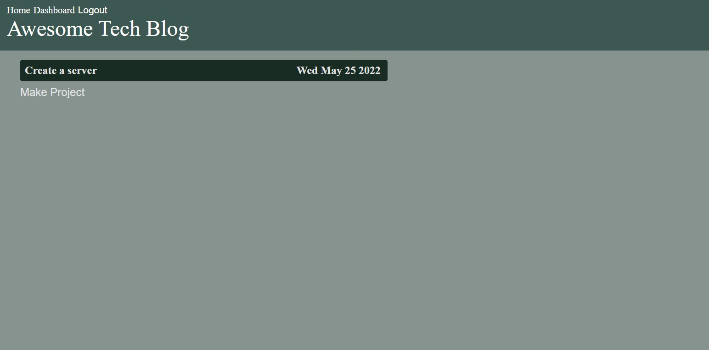

<div align="center">

# Awesome Tech Blog

</div>


<div align="center">

[](https://opensource.org/licenses/MIT) 

</div>


I wanted a place for users to be able to store ideas about current and future ideas relative to web design and programming. This provides an easy-to-use place to log in, create, and share ideas with like-minded individuals.

## Requirements

This application can be run from Heroku (link below), OR,
Download, install, and run the app locally.

## Table of Contents

* [Installation](#installation)
* [Credits](#credits)
* [Questions](#questions)

## Installation

Firstly, Download the application from this github repository by copying the URL from code and copy the following into the designated folder on your directory.
```
git clone {url}
```

Open the application in your text editor.
Setup your '.env' file.
Configure the application.

```
npm init -y
npm i
```
Navigate to the database
```
mysql -u root {Password}
SOURCE schema.sql
```
From the command line
```
npm run seed
```

Run the app
```
npm start
```
OR setup refresh
```
npm run watch
```

## Credits

[Origin 42](hyperlink): Dave Plummer

## Questions

Direct any questions too;

- [origin-42](https://github.com/origin-42)
- d.plummer89@hotmail.com

## Extras

[Home Page](https://technical-blogger-das-min.herokuapp.com/)
[](https://technical-blogger-das-min.herokuapp.com/) 
